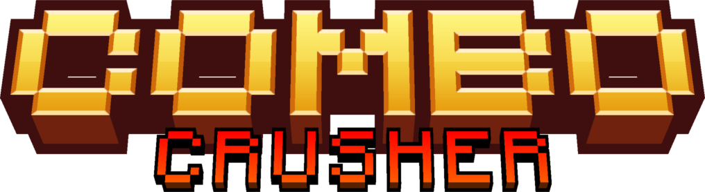

## About

You connect a controller to your computer and you can play it with that! So far there is support for Xbox Series X / S controller and (maybe) other controllers but I haven't tested them yet.

This is a controller game (made for controllers but `control.py` emulates a controller that you can use) where you are a character and there are waves of enemies that come at you that you defeat by sequentially pressing the buttons above their heads as you swing your sword / lightsaber / melee weapon or shoot your bow / gun / ranged weapon (Ideas / concept for lore)

And yes, the title *was* made with Blockbench, it is a (slightly prettier) placeholder title. It is better looking than a scribble in MS Paint after all.

Here is the combat level of the project:

* Enemy comes on screen, with the buttons **A**, **X** and **Y** above their heads.
* You hold the sword button and press **A** to hit them with attack A of your sword.
* Enemy now only has **X** and **Y** above their heads.
* You hold the ranged button and press **X** to shoot them with arrow X of your bow.
* Enemy now only has **Y** above their heads.
* Once you hit the Y attack, the enemy will die.
* And yes, this is inspired by the Google Doodle of the magic cat fighting off ghosts, except now there is a sword that only hits the enemies you swipe.

Basically you hit the A, B, X and Y in the same order as that on their heads to defeat them.
At least that's the plan, because currently the only thing in the entire project is a *very* fancy menu screen and a character who broke the fabrics of reality and caused everything to look like placeholder sprites. (That's a joke, my friend is currently working on a standard character, but for now... placeholder images. *\*sigh\**)

# **WARNING**

This game is in **VERY** early development and probably can't even be called a game yet. The GUI is the only thing fully done. I am actively working on the project to maybe make it a fully completed project. If you are looking for a game to play, do not play this. Instead, bookmark it and check on it later to see if it has good things on it. The only ways to control the tests are via keyboard and an Xbox Series X / S controller connected to your computer, and the only confirmed OS is Windows 11.

**However**,  if you are a developer, texture artist or you even have a good idea for a lore concept, contact me and I would gladly accept any help whatsoever towards the project and you will be featured in the credits of the game. So maybe you could help me in some way.

# How to test run
## Handling pip installs
External libraries (copy-paste into terminal):
pip install pygame
pip install pandas

Python version: Python 3.10.11 64-bit Windows 11
Works on Windows, not bothered to check on other operating systems
##
1. You run the project by running `main.py`.
2. If you have a supported controller (currently only Xbox Series X / S controller) connected, then nothing happens.
3. If you have no controller connected, then it uses the keyboard for inputs.
4. If you have a not supported controller (like PlayStation or Switch controllers), then it warns you:
    * **"Continue code without supported controllers? Y for yes (Experimental, might break!!!) -->"**
    * Proceed with y or Y, the capitalisation won't matter.
5. If you have a supported controller or a controller that you have already configured, it will ask you to bind game actions to your keyboard. Enter n or N to not bind it.
    * If you have not configured it before, it will automatically configure.
6. It launches a blue Pygame window for you to press the "Fullscreen" button so it knows your preferred screen size.
7. Enjoy the extremely buggy square in the centre of the screen with ugly placeholder textures that you move with left, right and jump buttons! That's... literally it. (Only one developer working on a game with NO GAME ENGINE is pretty hard, you know)